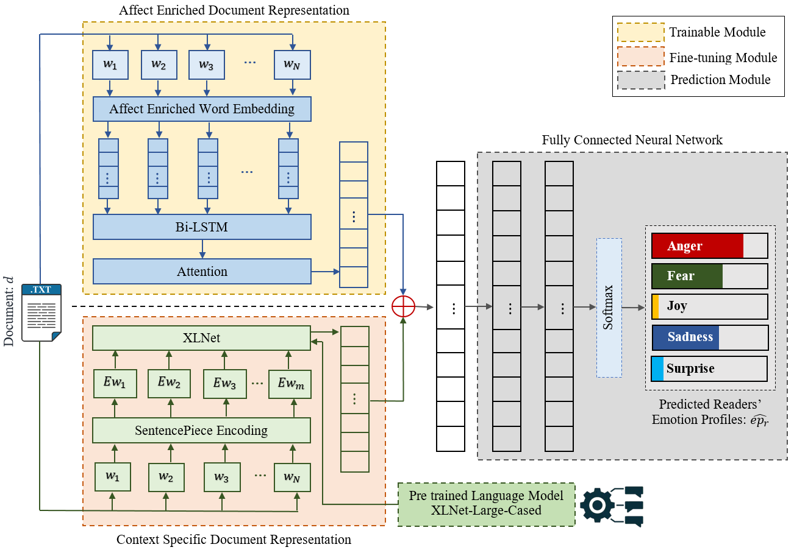

# REDAffectiveLM <br>
 

## REDAffectiveLM : Leveraging Affect Enriched Embedding and Transformer-based Neural Language Model for Readers' Emotion Detection </br>
Anoop K<sup>[1](#author1)</sup>, Deepak P.<sup>[2](#author2)</sup>, Manjary P Gangan<sup>[1](#author1)</sup>, Savitha Sam Abraham<sup>[3](#author3)</sup>, and Lajish V L<sup>[1](#author1)</sup> </br>
<a name="author1"><sup>1</sup></a> Department of Computer Science, University of Calicut, Kerala, India. </br>
<a name="author2"><sup>2</sup></a> School of Electronics, Electrical Engineering and Computer Science, Queen’s University Belfast, Northern Ireland, UK.</br>
<a name="author3"><sup>3</sup></a> The University of Adelaide, Adelaide, Australia

:memo: paper : https://link.springer.com/article/10.1007/s10115-024-02194-4 </br>
:memo: pre-print : https://arxiv.org/abs/2301.08995 </br>
:earth_asia: Link : https://dcs.uoc.ac.in/cida/projects/ac/redaffectivelm.html

**Abstract**:Technological advancements in web platforms allow people to express and share emotions towards textual write-ups written and shared by others. This brings about different interesting domains for analysis; emotion expressed by the writer and emotion elicited from the readers. In this paper, we propose a novel approach for Readers' Emotion Detection from short-text documents using a deep learning model called REDAffectiveLM. Within state-of-the-art NLP tasks, it is well understood that utilizing context-specifc representations from transformer-based pre-trained language models helps achieve improved performance. Within this afective computing task, we explore how incorporating afective information can further enhance performance. Towards this, we leverage context-specific and affect enriched representations by using a transformer-based pre-trained language model in tandem with affect enriched Bi-LSTM+Attention. For empirical evaluation, we procure a new dataset REN-20k, besides using RENh-4k and SemEval-2007. We evaluate the performance of our REDAffectiveLM rigorously across these datasets, against a vast set of state-of-the-art baselines, where our model consistently outperforms baselines and obtains statistically signifcant results. Our results establish that utilizing affect enriched representation along with context-specific representation within a neural architecture can considerably enhance readers' emotion detection. Since the impact of affect enrichment specifically in readers' emotion detection isn't well explored, we conduct a detailed analysis over affect enriched Bi-LSTM+Attention using qualitative and quantitative model behavior evaluation techniques. We observe that compared to conventional semantic embedding, affect enriched embedding increases the ability of the network to effectively identify and assign weightage to the key terms responsible for readers' emotion detection to improve prediction.

For other inquiries, please contact: </br>
1. Anoop K, University of Calicut, Kerala, India. :email: anoopk_dcs@uoc.ac.in </br> 
2. Deepak P., Queen’s University Belfast, Northern Ireland, UK. :email: deepaksp@acm.org </br>
3. Manjary P Gangan, University of Calicut, Kerala, India. :email: manjaryp_dcs@uoc.ac.in </br>
4. Savitha Sam Abraham, Örebro University, Örebro, Sweden. :email:  savitha.sam-abraham@oru.se </br>
5. Lajish V. L., University of Calicut, Kerala, India. :email: lajish@uoc.ac.in

## Citation
```
will update soon 
```

## Acknowledgement
The authors thankfully acknowledge Arjun K. Sreedhar, Dheeraj K., Sarath Kumar P. S., and Vishnu S., the postgraduate students of the Department of Computer Science, University of Calicut, who have been involved in dataset procurement. The third author would like to thank the Department of Science and Technology (DST) of the Government of India for fnancial support through the Women Scientist Scheme-A (WOS-A) for Research in Basic/Applied Science under the Grant SR/WOS-A/PM-62/2018. The authors thankfully acknowledge the popular leading digital media company RAPPLER for the data source of news data along with associated emotions from their online portal that very relevantly helped to conduct this research.

